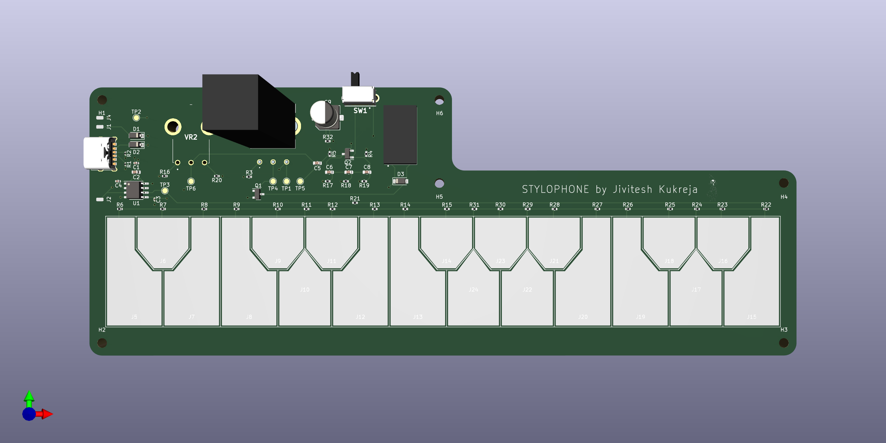

## Members
Jivitesh Kukreja, Electrical Engineering (2024)
jiviteshkuk26@vt.edu

## Repo Link
<a class="button is-link" href="https://github.com/Amp-Lab-at-VT/Stylophone">Stylophone</a>

## Photo

## Mentor
Richard Gibbons

## Current Status
In Progress

## Project Overview
This Project is about creating a stylophone using a TLC555 timer IC. There are 20 keys each associated with a distinct musical note. 
Every time the stylus touches a key frequency associated with that key is heard on the speaker.
There is also vibrato mode which when selected acts like sustain on pianos.

## Educational Value Added
This Project with help me learn:
1. How to design low frequency oscillators
2. How to a simple audio amplifier 
3. How to design PCB

## Tasks
1. Design a square wave generator using TLC555 that produces different frequencies with different resistor values.
2. Design an audio amplifier that drives the speaker.
3. Design a low-frequency sine wave generator for vibrato effect.
4. Power everything with a USB c connector. 

[//]: # Design Decisions

[//]: ## Design Misc

[//]: ## Steps for Documenting Your Design Process

## BOM + Component Cost
<a class="button is-link" href="https://github.com/Amp-Lab-at-VT/Stylophone/blob/main/Fabrication%20Files/Stylophone%20BOM.csv">Bill Of Materials</a>

## Timeline
SEPTEMBER: Circuit Design 
OCTOBER: PCB Design and Protoboard Testing
NOVEMBER: Assembly and Testing

## Useful Links
https://www.waitingforfriday.com/?p=334
https://www.instructables.com/Retro-Stylophone-NE555-Based/

[//]: ## Log